# Web_Solution_With_Wordpress_101_103
## Web_Solution_With_Wordpress_101
WordPress (also known as WP or WordPress.org) is a web content management system. It was originally created as a tool to publish blogs but has evolved to support publishing other web content, including more traditional websites, mailing lists and Internet forum, media galleries, membership sites, learning management systems and online stores. Available as free and open-source software, WordPress is among the most popular content management systems. 

WordPress is written in the PHP language and paired with a MySQL or MariaDB database. Features include a plugin architecture and a template system, referred to within WordPress as "Themes".

To function, WordPress has to be installed on a web server, either as part of an Internet hosting service or on a computer running the WordPress software package.
## Web_Solution_With_Wordpress_102
- First, created an ec2 instance named it as "Webserver" in a region "Mumbai" with instance type "t3.small", AMI (Amazon Machine Image ) as "Red Hat", at first created security group having inbound rules for (SSH),Http and Https.
- Private key was generated and named it as : "webserver" and downloaded ".pem" file.
- Used the same private key previously downloaded to connect to EC2 instace via ssh as in previous projects.
- Similary , second EC2 instance was created named it as "database_server" in a region "Stockholm" with instance type "t3.small", AMI (Amazon Machine Image ) as "Red Hat", at first created security group having inbound rules for (SSH),later on added port 3306 all other required configuration was selected as default here.and connected to virtual server using same ".pem" file as the same private key was used for this instance. 
 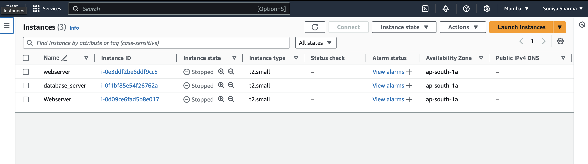  
- Created 3 volumes in the same Availability zone(ap-south-1a) each of 10 GB for webserver in the EBS inside volume section and attach it to the webserver and another 3 volumes for database_server instance and attached it to the database_server with different device name.
 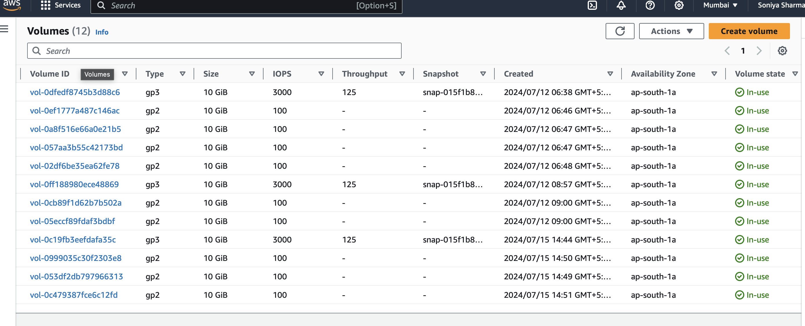

### For Webserver :
- Created partitions on each disk:
    ```
    sudo gdisk /dev/xvdb
    sudo gdisk /dev/xvdc
    sudo gdisk /dev/xvdd
    ```
    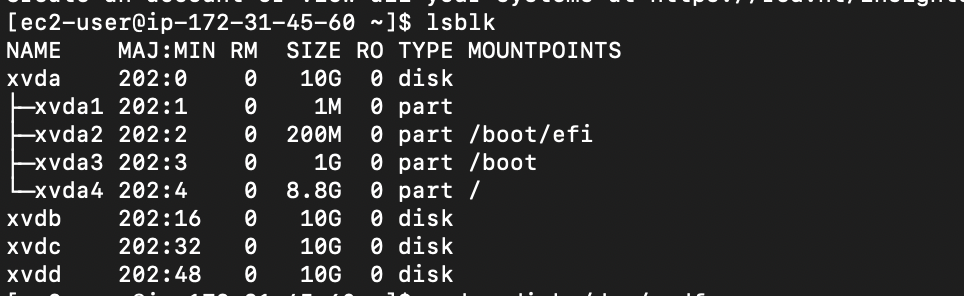
- For each command did :
    - Enter n for new partition.
    - Choose default partition number (e.g., 1).
    - Choose default first and last sectors to use the entire disk.
    - Enter w to write partition table to disk.
    - Click y to confirm.
    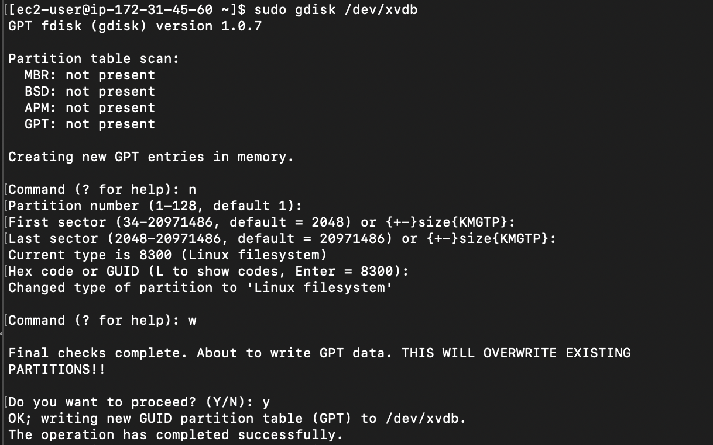
- Installed LVM packages:
    ```
    sudo yum install lvm2 -y
    ```
    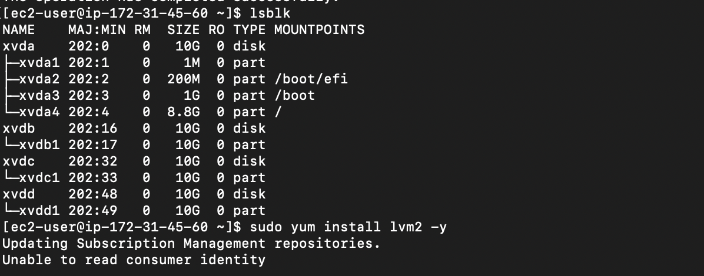
- Created physical volumes (PVs) on each disk:
    ```
    sudo pvcreate /dev/xvdb1 /dev/xvdc1 /dev/xvdd1
    ```
- Verify the PVs:
    ```
    sudo pvs
    ```

- Created a volume group (VG):
    ```
    sudo vgcreate webdata-vg /dev/xvdb1 /dev/xvdc1 /dev/xvdd1
    ``` 

- Verified the VG:
    ```
    sudo vgs
    ```

- Created logical volumes (LVs):
    ```
    sudo lvcreate -n lv-apps -L 14G webdata-vg
    sudo lvcreate -n lv-logs -L 14G webdata-vg
    ```
- Verified the LVs:
    ```
    sudo lvs
    ```
    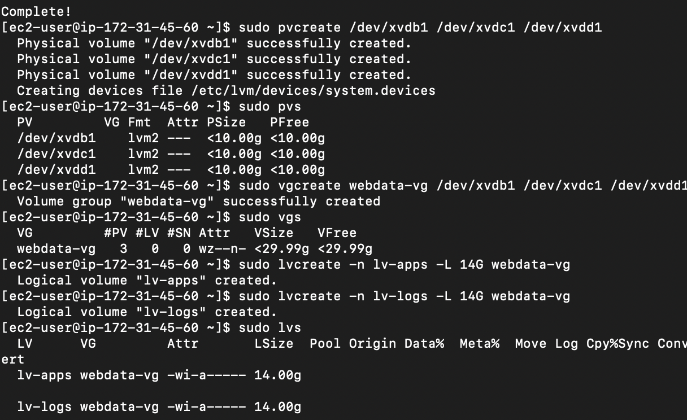
- Created file systems on the LVs:
    ```
    sudo mkfs.ext4 /dev/webdata-vg/lv-apps
    sudo mkfs.ext4 /dev/webdata-vg/lv-logs
    ```
- Created mount points and mounted the LVs:
    ```
    sudo mkdir -p /var/www/html
    sudo mkdir -p /home/recovery/logs
    ```
    ```
    sudo mount /dev/webdata-vg/lv-apps /var/www/html/
    sudo rsync -av /var/log/ /home/recovery/logs/
    ```
    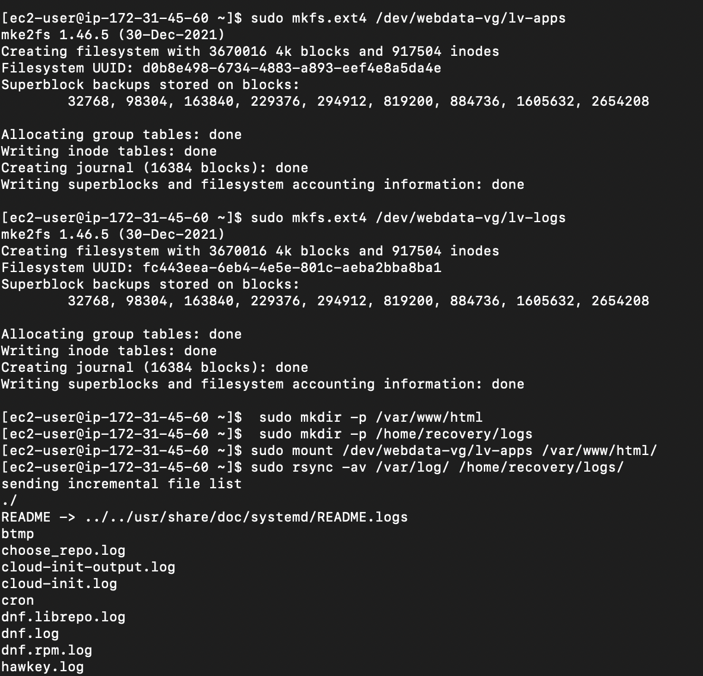

- Updated /etc/fstab to make mounts persistent:
    ```
    sudo blkid
    ```

    ```
    sudo vi/etc/fstab
    ```
- Inside file, added the 
    ```
    (UUID of /dev/mapper/webdata--vg-lv--apps get from running command blkid) /var/www/html ext4 defaults 0 0
    (UUID of /dev/mapper/webdata--vg-lv--logs) 
    /home/recovery/logs ext4 defaults 0 0
    ```
- Reloades system to apply the changes:
    ```
    sudo systemctl daemon-reload
    ```
- Tested if the mounts are correct:
    ```
    sudo mount -a
    df -h
    ```
    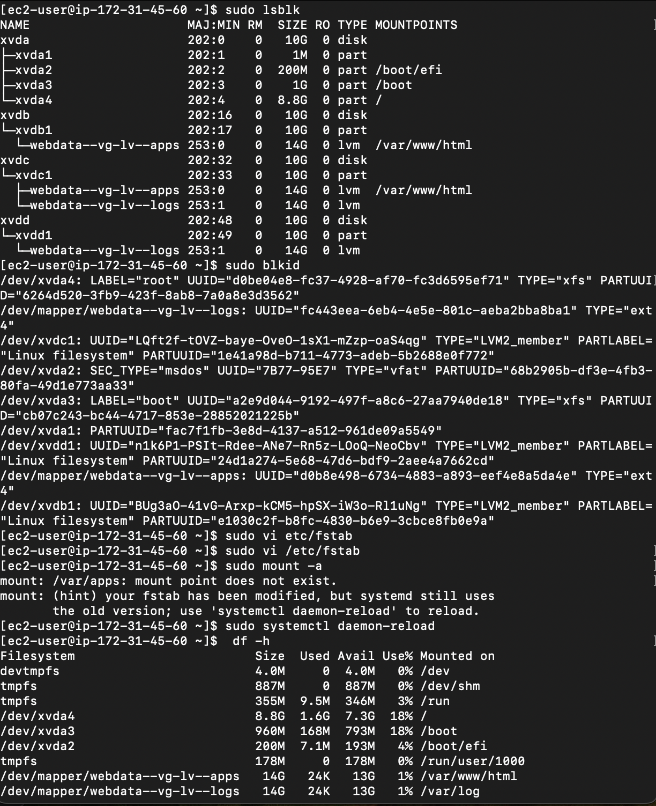


### For database server :
- Created partitions on each disk:
    ```
    sudo gdisk /dev/xvdb
    sudo gdisk /dev/xvdc
    sudo gdisk /dev/xvdd
    ```
- For each command did :
    - Enter n for new partition.
    - Choose default partition number (e.g., 1).
    - Choose default first and last sectors to use the entire disk.
    - Enter w to write partition table to disk.
    - Click y to confirm.
- Installed LVM packages:
    ```
    sudo yum install lvm2 -y
    ```
- Created physical volumes (PVs) on each disk:
    ```
    sudo pvcreate /dev/xvdb1 /dev/xvdc1 /dev/xvdd1
    ```
- Verify the PVs:
    ```
    sudo pvs
    ```

- Created a volume group (VG):
    ```
    sudo vgcreate webdata-vg /dev/xvdb1 /dev/xvdc1 /dev/xvdd1
    ``` 

- Verified the VG:
    ```
    sudo vgs
    ```

- Created logical volumes (LVs):
    ```
    sudo lvcreate -n lv-db -L 14G webdata-vg
    sudo lvcreate -n lv-logs -L 14G webdata-vg
    ```
- Verified the LVs:
    ```
    sudo lvs
    ```

- Created file systems on the LVs:
    ```
    sudo mkfs.ext4 /dev/webdata-vg/lv-db
    sudo mkfs.ext4 /dev/webdata-vg/lv-logs
    
    ```
- Created mount points and mounted the LVs:
    ```
    sudo mkdir -p /db
    sudo mkdir -p /logs
    ```
    ```
    sudo mount /dev/webdata-vg/lv-apps /db
    ```

- Updated /etc/fstab to make mounts persistent:
    ```
    sudo blkid
    ```

    ```
    sudo vi/etc/fstab
    ```
- Reloaded system to apply the changes:
    ```
    sudo systemctl daemon-reload
    ```
- Tested if the mounts are correct:
    ```
    sudo mount -a
    df -h
    ```
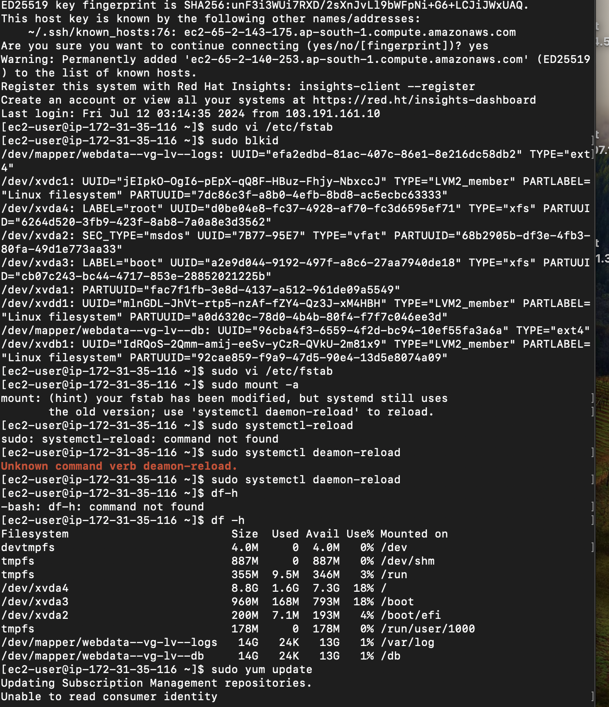

## Web_Solution_With_Wordpress_103
### Installed Wordpress on Webserver instance:
- Updated the System and Install Apache
    ```
    sudo yum update -y
    sudo yum -y install wget httpd php php-fpm php-json
    sudo systemctl enable httpd
    sudo systemctl start httpd
    ```
- Installed PHP and Dependencies
    ```
    sudo yum install https://dl.fedoraproject.org/pub/epel/epel-release-latest-8.noarch.rpm
    sudo yum install yum-utils http://rpms.remirepo.net/enterprise/remi-release-8.rpm
    sudo yum module list php 
    sudo yum module reset php
    sudo yum module enable php:remi-7.4
    sudo yum install php php-opache php-gd php-curl php-mysqlnd
   ```
- Configure PHP-FPM and SELinux
    ```
    sudo systemctl start php-fpm
    sudo systemctl enable php-fpm
    sudo setsebool -P httpd_execmem 1
    sudo setsebool -P
    httpd_can_network_connect=1
    ```
    - Download and Configure WordPress
    ```
    sudo wget http://wordpress.org/latest.tar.gz
    sudo tar xzvf latest.tar.gz -C /var/www/html/
    sudo mkdir /var/www/html/wordpress
    sudo cp -r wordpress/* /var/www/html/wordpress/
    cd /var/www/html/wordpress
    ls -l
    sudo rm latest.tar.gz
    sudo cp /var/www/html/wordpress/wp-config-sample.php /var/www/html/wordpress/wp-config.php
    ls -l /var/www/html/wordpress
    ```
- Configured SELinux Policies
    ```
    sudo chown -R apache:apache /var/www/html/wordpress
    sudo chcon -t httpd_sys_rw_content_t /var/www/html/wordpress -R
    sudo setsebool -P httpd_can_network_connect=1
    ```
    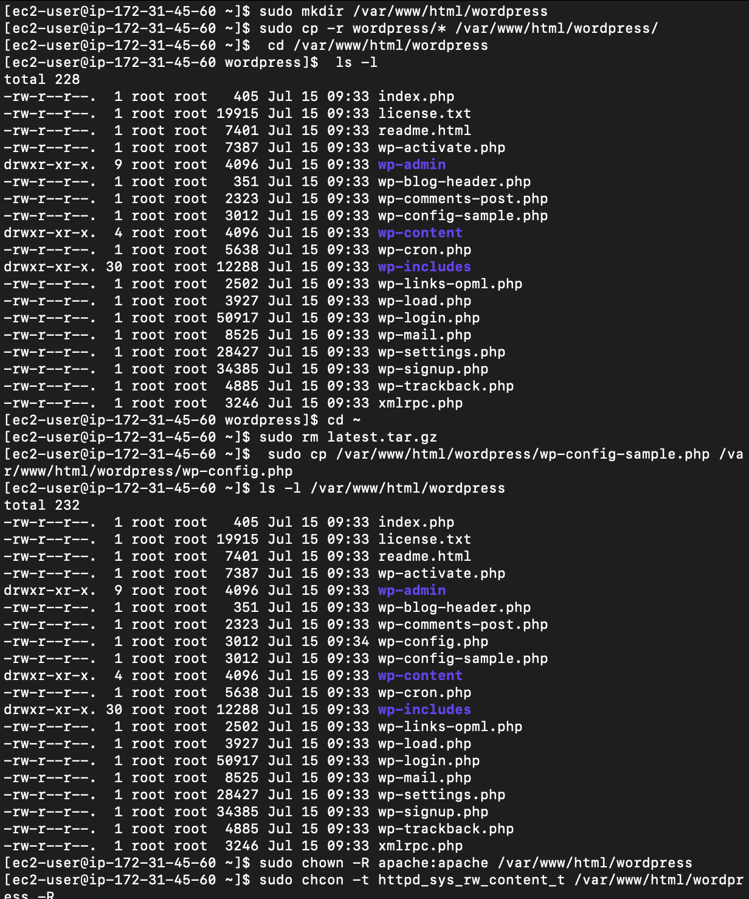
### Installed MYSQL on database_server:
- Updated the yum
    ```
    sudo yum update
    sudo yum install mysql-server
    sudo systemctl restart mysqld
    sudo systemctl enable mysqld
    ```
- Configured DB to work with Wordpress
    ```
    sudo mysql
    CREATE DATABASE wordpress;
    CREATE USER `myuser`@'172.31.46.126(webserver_private_ip)' IDENTIFIED BY 'mypass';
    GRANT ALL ON wordpress.* TO 'myuser'@'172.31.46.126(webserver_private_ip)';
    FLUSH PRIVILEGES;
    exit
    ```
    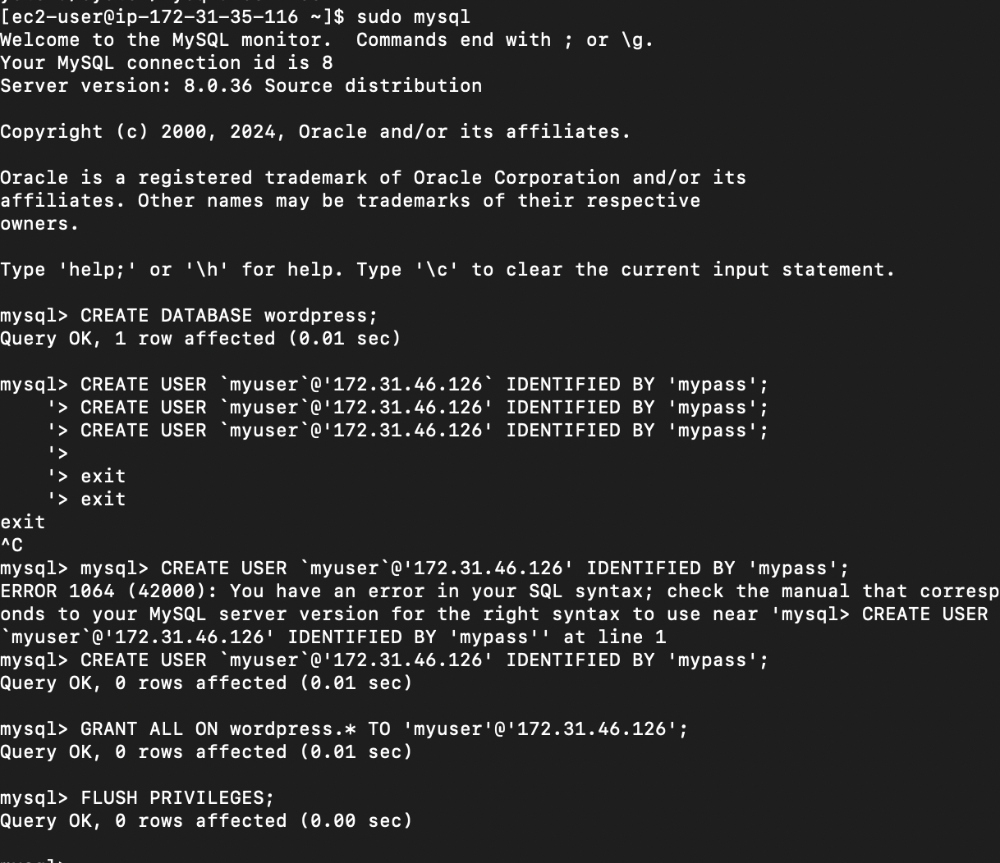
- Configured Wordpress to connect to remote database 
    - Added inbpund rule in dataabse_server for TCP 3306 (MySQL/ Aurora) with source (webserver_private_ip)/32.

### Installed mysql on webserver and tested that can be connected to database server from webserver using mysql-client:
- Installed mysql :
    ```
    sudo yum install mysql
    sudo mysql -u myuser -p -h 172.31.35.116 (database_server_private_ip)
    ```
    ```
    cd /var/www/html/wordpress
    sudo vi  wp-config.php
    ```
    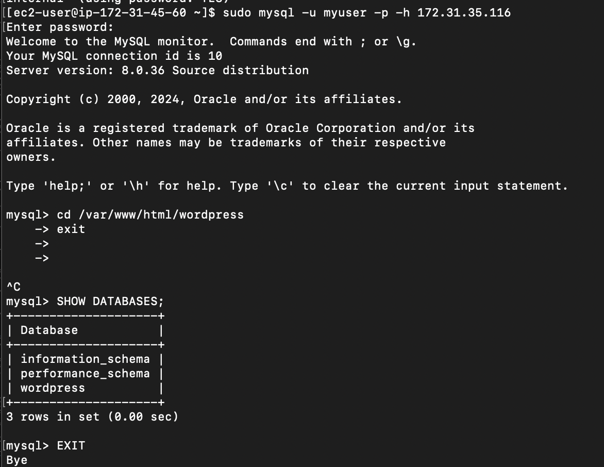

- Inside config file, updated :
    define('DB_NAME', 'wordpress');
    define('DB_USER', 'myuser');
    define('DB_PASSWORD', 'mypass');
    define('DB_HOST', 'DB-Server-Private-IP');
- Navigated tothe  Web Server's public IP to finish the WordPress setup.
    ```
    http:://webserver_public_ip/wordpress/
    ```


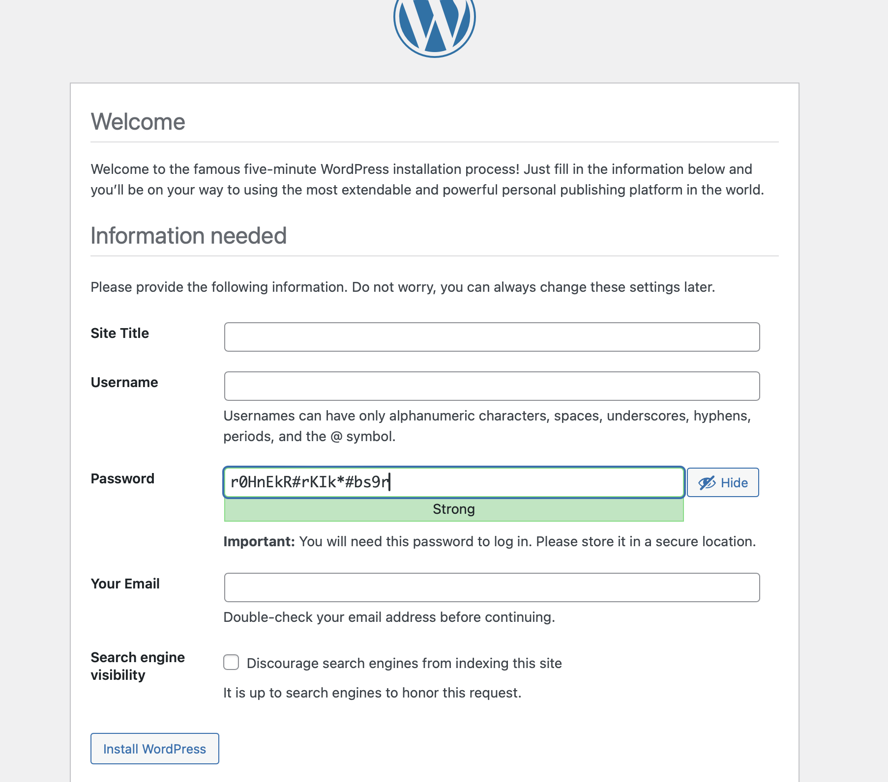
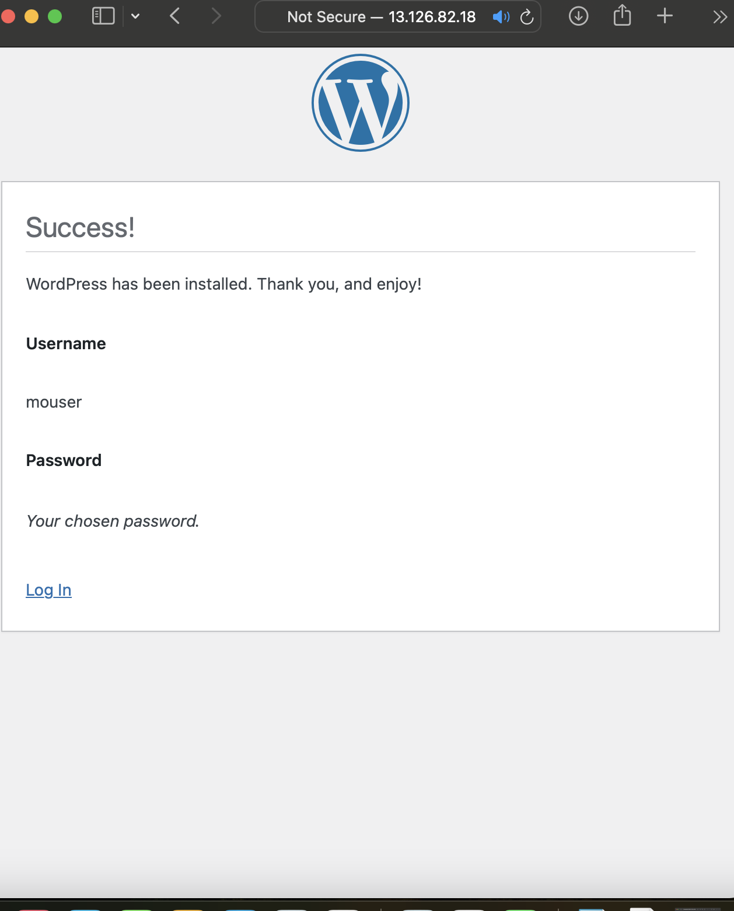

## Conclusion:
In this documentation, we learned how to create and attach EBS volumes to our instance, partition them, and create logical volumes to store our WordPress website. We also successfully created a WordPress website, hosted the website files on our Apache web server, and set up the database on a separate server, enabling remote connections to it.

